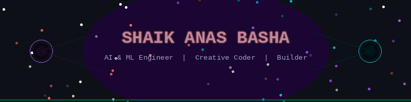
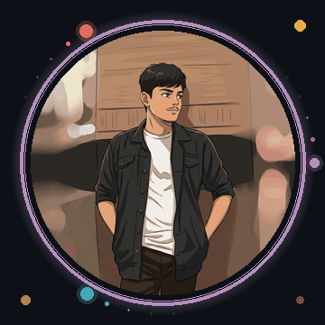
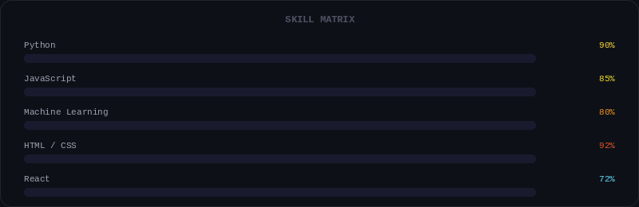

<!-- HEADER GIF -->

  

---

#  𝗜'𝗺 𝗔𝗻𝗮𝘀 𝗕𝗮𝘀𝗵𝗮 ✨

<table>
  <tr>
    <td style="vertical-align: top; width: 70%;">
      <h3>🤖 I'm a passionate <strong>AI & ML Engineer</strong></h3>
      
Building intelligent systems that solve real-world problems.

      <h3>🎆 Creator of <strong>VFX Vault</strong></h3>
      
772+ live particle & VFX effects — pure HTML5 Canvas, zero frameworks.

      <h3>🏆 <strong>Hackathon Team Lead</strong></h3>
      
Led team to build SalesIQ — AI forecasting dashboard at KLU Hackathon.

      <h3>🌐 Open to <strong>collaborations</strong></h3>
      
Excited to work on AI, ML, and creative web projects.

    </td>
    <td style="text-align: right; vertical-align: top;">
      
    </td>
  </tr>
</table>

---

<h2 align="left">🤝 Cᴏɴɴᴇᴄᴛ Wɪᴛʜ Mᴇ 🤝</h2>

  
  &nbsp;
  
  &nbsp;
  
  &nbsp;
  

✨ _Let's connect and build something amazing together!_ ✨

---

### 🐍 GitHub Contribution Snake

  <picture>
    <source media="(prefers-color-scheme: dark)" srcset="https://raw.githubusercontent.com/SHAIKANASBASHA-55/SHAIKANASBASHA-55/output/github-snake-dark.svg"/>
    <source media="(prefers-color-scheme: light)" srcset="https://raw.githubusercontent.com/SHAIKANASBASHA-55/SHAIKANASBASHA-55/output/github-snake.svg"/>
    
  </picture>

---

<h2 align="center">⚡ Sᴋɪʟʟ Mᴀᴛʀɪx</h2>

  

 

<h3 align="left">💡 Skills & Current Learnings</h3>

<ul align="left">
  <li>🤖 <strong>Machine Learning & AI</strong> Ensemble models, SHAP explainability, time-series forecasting.</li> 
  <li>🎆 <strong>Creative Coding</strong> HTML5 Canvas, particle systems, VFX animations — zero dependencies.</li> 
  <li>⚛️ <strong>React.js</strong> Component architecture, hooks, state management.</li> 
  <li>📊 <strong>Data Science</strong> Pandas, NumPy, scikit-learn, model training & evaluation.</li> 
  <li>🌐 <strong>Full Stack Development</strong> Python backends, REST APIs, responsive frontends.</li>
</ul>

---

<h2 align="center">⚒️ Mʏ Sᴋɪʟʟs & Uᴛɪʟɪᴛɪᴇs</h2>

  <table style="width:100%; border-collapse:collapse; text-align:center;">
    <thead>
      <tr>
        <th>🟦 Languages</th>
        <th>🤖 AI & ML</th>
        <th>🎨 Frontend</th>
        <th>💻 IDEs & Tools</th>
      </tr>
    </thead>
    <tbody>
      <tr>
        <td>
          
          
          
          
        </td>
        <td>
          
          
          
          
        </td>
        <td>
          
          
          
        </td>
        <td>
          
          
          
        </td>
      </tr>
    </tbody>
  </table>

---

## 🚀 Featured Projects

| 🎆 VFX Vault | 📊 SalesIQ |
|---|---|
| 772+ live particle & VFX effects | AI Sales Forecasting · 🏆 KLU Hackathon |
| Pure HTML5 Canvas + JS · Zero frameworks | RF + GBM + Deep MLP Ensemble |
| 🔥 Fire · 🌌 Space · ⚡ Cyber · 💧 Fluid | Live yfinance · SHAP · 90% CI |
|  ·  |  |

---

### 📊 GitHub Stats

---

  

<h2 align="left">🌟 Tʜᴏᴜɢʜᴛ ᴏғ ᴛʜᴇ Dᴀʏ 🌟</h2>

  

  

  <i>⭐ Star my repos if you find them useful — it keeps me motivated! 🚀</i> 
  <i>Made with ❤️ · Shaik Anas Basha · KL University · India 🇮🇳</i>

